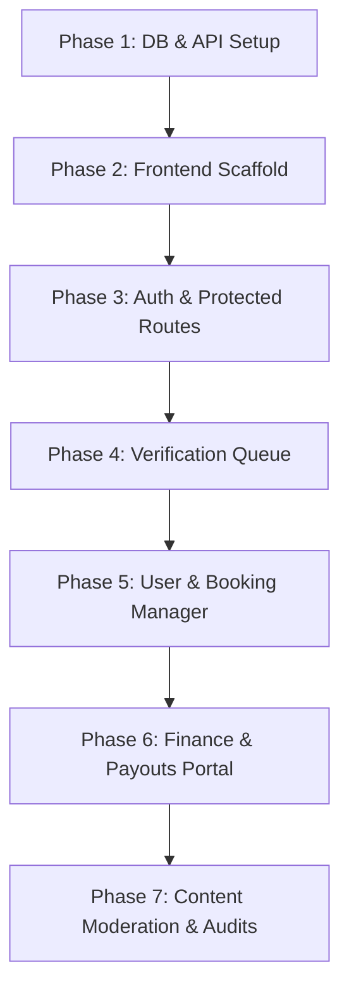

# NirogApp Admin Panel — Architectural Guide & Blueprint

This document outlines the detailed structure, directory layouts, database mappings, and implementation steps for building the **NirogApp Admin Panel**. The setup uses **React.js + Vite** for the frontend, **Node.js + Express** for the backend, **TypeScript** across both layers, and **Tailwind CSS** for layout styling.

---

## 1. Overview of the NirogApp Ecosystem

Based on the existing database schema (`schema.prisma`), NirogApp is a multi-sided HealthTech marketplace containing 5 core roles:

1. **PATIENT**: Books appointments, writes reviews, maintains medical records.
2. **DOCTOR**: Offers consults, configures availability, writes medical content, requests payouts.
3. **PROVIDER**: (Hospitals, clinics, labs, pharmacies) Lists services, hosts appointments, requests payouts.
4. **STUDENT**: Enrolls in medical courses, interacts with content hub materials.
5. **ADMIN**: Moderates content, manages verifications, handles support reports, oversees payments/refunds.

The **Admin Panel** must act as the control center, allowing internal administrative users (with the `ADMIN` role) to monitor database activity, approve verified entities, inspect financial transactions, and moderate reports.

---

## 2. Tech Stack & Integration

*   **Frontend**: React (Vite-powered template), TypeScript, Tailwind CSS, and `Lucide React` (for icons).
*   **Routing**: React Router v6 or v7.
*   **State & API Fetching**: TanStack Query (`@tanstack/react-query`) + Axios (highly recommended for automatic caching, synchronization, and simple CRUD updates).
*   **Backend**: Node.js, Express.js, TypeScript, and Prisma ORM client (already initialized in `backend/`).

---

## 3. Directory Layouts

### A. Frontend Layout (`admin-panel/`)
For the frontend, initialize a standalone Vite project inside the workspace root named `admin-panel`.

```text
admin-panel/
├── public/
├── src/
│   ├── assets/              # Logos, default avatars, background patterns
│   ├── components/          # Reusable shared UI elements
│   │   ├── ui/
│   │   │   ├── button.tsx
│   │   │   ├── table.tsx
│   │   │   ├── modal.tsx
│   │   │   ├── input.tsx
│   │   │   └── badge.tsx    # Status badges (Approved, Pending, Active)
│   │   ├── Sidebar.tsx      # Main navigation menu
│   │   ├── Header.tsx       # Profile info, notifications panel, toggle dark-mode
│   │   └── ProtectedRoute.tsx # Component to guard admin routes
│   ├── config/
│   │   └── api.ts           # Axios instance with baseURL and interceptors for authorization headers
│   ├── hooks/               # Custom hooks (e.g. useAuth, useDebounce)
│   ├── layouts/
│   │   └── DashboardLayout.tsx # Shell component holding Sidebar + Header + Outlet
│   ├── pages/               # Main route views
│   │   ├── Login.tsx        # Authentication view (Sign In)
│   │   ├── Dashboard.tsx    # Landing view with metrics/charts
│   │   ├── verifications/
│   │   │   ├── VerificationQueue.tsx # Approvals dashboard for Doctor, Student, Provider profiles
│   │   │   └── VerificationDetail.tsx # Review credentials, licenses, identity verification documents
│   │   ├── users/
│   │   │   ├── UserList.tsx          # Manage profiles, activate/deactivate accounts
│   │   │   └── UserDetail.tsx        # Detail log of user actions
│   │   ├── bookings/
│   │   │   └── BookingList.tsx       # Global appointment list & status overrides
│   │   ├── finance/
│   │   │   ├── TransactionList.tsx   # Payment logs (Payments, Refunds)
│   │   │   └── PayoutList.tsx        # Provider/Doctor payout approval
│   │   ├── content/
│   │   │   ├── ContentModeration.tsx # Draft/published posts and flagged article reports
│   │   │   └── CourseManager.tsx     # Student course list and pricing config
│   │   ├── reports/
│   │   │   └── ReportList.tsx        # Report flags (fake accounts, spam, inappropriate comments)
│   │   └── settings/
│   │       └── AdminSettings.tsx     # Admin departments, API keys, password update
│   ├── types/
│   │   └── index.ts         # TypeScript interfaces (User, DoctorProfile, Booking, etc.)
│   ├── utils/
│   │   └── formatters.ts    # Date, currency (INR), status color mappings
│   ├── App.tsx              # Component routing hierarchy setup
│   ├── index.css            # Tailwind directives and utility classes
│   ├── main.tsx             # Entry point mount
│   └── vite-env.d.ts
├── package.json
├── postcss.config.js
├── tailwind.config.js
├── tsconfig.json
└── vite.config.ts
```

### B. Backend Extensions (`backend/`)
In the existing backend structure, add admin endpoints. We recommend nesting them under `/api/admin/` or within existing controllers with appropriate RBAC (Role-Based Access Control) middleware.

```text
backend/src/
├── middlewares/
│   ├── auth.middleware.ts        # Verifies JWT token
│   └── role.middleware.ts        # Verifies roles (e.g., req.user.role === 'ADMIN')
├── routes/
│   ├── index.ts                  # Register admin routes mapping
│   └── admin/
│       ├── auth.routes.ts        # Admin authentication actions
│       ├── dashboard.routes.ts   # Metrics aggregation endpoint
│       ├── verification.routes.ts# Handles approvals/rejections of doctor, student, provider docs
│       ├── user-mgmt.routes.ts   # Controls profile toggling, deactivations, search
│       ├── finance.routes.ts     # Payout calculations and refund trigger hooks
│       └── moderation.routes.ts  # Handles system report tickets and flags
├── controllers/
│   └── admin/
│       ├── dashboard.controller.ts
│       ├── verification.controller.ts
│       ├── user-mgmt.controller.ts
│       ├── finance.controller.ts
│       └── moderation.controller.ts
└── services/                     # Reusable business logic (Prisma queries)
    └── admin.service.ts
```

---

## 4. Core Modules: Detailed Blueprint

Here are the functional screens you need to add to the Admin Panel, including their database maps and fields:

### Module 1: Admin Authentication & RBAC Guard
*   **Database Tables**: `User` (`role: ADMIN`), `AdminProfile`, `Session`.
*   **Requirements**:
    *   Secure login with email/password.
    *   Automatic session expiry handling.
    *   Protected routing to prevent non-admin roles (`PATIENT`, `DOCTOR`, `STUDENT`, `PROVIDER`) from hitting dashboard views or REST endpoints.
    *   **RBAC Middleware** checks `req.user.role === 'ADMIN'` before invoking any controller.

### Module 2: Analytics Dashboard
*   **Database Tables**: Aggregates records from `User`, `Booking`, `Payment`, `Review`, `Report`.
*   **KPIs & Graphs Needed**:
    *   *Total Users Counter*: Categorized by PATIENT, DOCTOR, STUDENT, PROVIDER.
    *   *System Status summary*: Count of Pending Profile Verifications and Unresolved Reports.
    *   *Booking Statistics*: Total bookings, bookings split by type (In-person, Video, Chat), and Booking Status tracking.
    *   *Financial Summary*: Total sales, total payouts, net profit platform fees.
    *   *Trend Charts*: Bar charts for monthly revenue, line charts for daily user registrations.

### Module 3: Profile Verification Portal (Crucial Screen)
Doctors, Students, and Providers are allowed to register on the client side, but their profiles must be manually approved by administrators before they appear on the public platform.
*   **Database Tables**: `DoctorProfile`, `StudentProfile`, `ProviderProfile`, `MediaFile`, `VerificationLog`.
*   **Requirements**:
    *   **Verification Queue View**: List profiles with status `PENDING` or `UNDER_REVIEW`.
    *   **Verification Details Form**:
        *   Display registration number, credentials, and uploaded credential documents (e.g. `licenseDocument`, `studentIdFile`, `permitFile`).
        *   Implement PDF or image viewing panels for uploaded credentials.
        *   Add **Approve** and **Reject** buttons.
        *   Rejections require a notes field specifying why the applicant failed (e.g., "Mismatched ID picture", "Invalid license number").
        *   Writing to `VerificationLog` to track which admin authorized the status transition.

### Module 4: User & Profile Management
*   **Database Tables**: `User`, `UserProfile`, `Address`.
*   **Requirements**:
    *   Searchable directory of all system users.
    *   Filter criteria: Active/Inactive status, date registered, role.
    *   Detail view containing addresses, history of bookings, profile statistics.
    *   Actions: Activate, deactivate (block), or soft-delete accounts (`deletedAt` timestamp).

### Module 5: Appointments & Booking Tracker
*   **Database Tables**: `Booking`, `User` (Patient details), `DoctorProfile`, `ProviderProfile`.
*   **Requirements**:
    *   Filter appointments by date range, provider type, patient name, and scheduling code.
    *   Update Booking status (e.g., manually mark as Completed, Confirmed, or Rescheduled).
    *   Cancel bookings on patient/doctor request (triggers auto-refund routing if payment was made).

### Module 6: Financial Ledger & Payout Approvals
*   **Database Tables**: `Payment`, `Transaction`, `Refund`, `Payout`.
*   **Requirements**:
    *   **Payment Log**: View total payments, transaction state, payment provider (Razorpay/Stripe details), and status codes.
    *   **Payout Approval Queue**:
        *   A listing of calculated platform payouts due to doctors and clinics after booking completion.
        *   Form containing destination bank account details (`bankAccount`).
        *   Action to mark payouts as `SUCCESS`, inserting processing dates and UTR tracking numbers (`utrNumber`).
    *   **Refund Actions**: Trigger and confirm partial or complete refunds of cancelled services back through Razorpay/Stripe.

### Module 7: Moderation, Content & Support Reports
*   **Database Tables**: `Report`, `Review`, `Content` (Articles & Courses), `ContentComment`.
*   **Requirements**:
    *   **Tickets Queue**: Show flagged content, spam reports, and reviews reported by users.
    *   **Moderation Panel**: Toggle article visibility, delete/hide inappropriate content comments, block abusive users.
    *   **Support Panel**: Review dispute details, insert resolution notes, and resolve report tickets.

---

## 5. Step-by-Step Implementation Roadmap



### Phase 1: Database & API Setup (Backend)
1. Write custom admin controllers inside `backend/src/controllers/admin/`.
2. Map the endpoints using `admin.routes.ts` structure and mount it in the root Express router (`backend/src/routes/index.ts`).
3. Setup **RBAC Middlewares**:
   *   `authenticateAdmin` checks the validity of JWT tokens from authorization headers.
   *   `requireRole(['ADMIN'])` verifies the database user role.
4. Test basic list queries with Prisma client (e.g., retrieving counts of pending profiles).

### Phase 2: Frontend Scaffold (Vite + Tailwind)
1. Initialize the project inside the main directory:
   ```bash
   npm create vite@latest admin-panel -- --template react-ts
   ```
2. Configure **Tailwind CSS** (run CSS directives setup in `src/index.css` and configure `tailwind.config.js`).
3. Install base libraries:
   *   Routing: `npm install react-router-dom`
   *   Icons: `npm install lucide-react`
   *   HTTP Client: `npm install axios`
   *   State Management: `npm install @tanstack/react-query`
   *   Charts: `npm install recharts`

### Phase 3: Authentication & Protected Routes
1. Create a `LoginPage` page layout inside `src/pages/Login.tsx`.
2. Configure the authorization hook `useAuth` storing tokens securely in local storage or session state.
3. Configure `ProtectedRoute.tsx` block to redirect unauthorized routes back to login.
4. Establish the `DashboardLayout.tsx` shell, styling a static, responsive collapsable **Sidebar** and **Header**.

### Phase 4: Verification Queue (Highest Priority Business Flow)
1. Implement the dashboard UI tables displaying Doctor verification requests with status filters.
2. Build custom overlay modals showing verification documents (licensing, institution IDs, etc.).
3. Connect button triggers to update database columns (`verificationStatus: APPROVED` or `REJECTED`), pushing log reports automatically.

### Phase 5: Management CRUD Views
1. Build out the **User Directory** with pagination and profile-state toggling.
2. Build the **Booking Tracker** grid view, integrating status updating functions.

### Phase 6: Finance Ledger & Payout Actions
1. Map transaction reports, showing total amounts, net income calculations, and status codes.
2. Implement the **Payout Approvals Interface** containing verification checks and UTR input logs to record payment completions.

### Phase 7: Moderation, Content Management & Auditing
1. Integrate the system reports view for dispute handling.
2. Integrate the **Audit Log Viewer** component showing `actorId`, `ipAddress`, and executed `action` histories.

---

## 6. Code Examples & Implementations

### Backend: Admin Authentication and RBAC Middleware Example
*`backend/src/middlewares/role.middleware.ts`*
```typescript
import { Request, Response, NextFunction } from 'express';
import { UserRole } from '@prisma/client';

export interface AuthenticatedRequest extends Request {
  user?: {
    id: string;
    email: string;
    role: UserRole;
  };
}

export const requireRole = (allowedRoles: UserRole[]) => {
  return (req: AuthenticatedRequest, res: Response, next: NextFunction) => {
    if (!req.user) {
      return res.status(401).json({ message: 'Unauthorized. Authentication token missing.' });
    }

    if (!allowedRoles.includes(req.user.role)) {
      return res.status(403).json({ 
        message: `Forbidden. Role '${req.user.role}' does not have permission to access this resource.` 
      });
    }

    next();
  };
};
```

### Frontend: Protected Routing Guard Setup
*`admin-panel/src/components/ProtectedRoute.tsx`*
```tsx
import React from 'react';
import { Navigate, Outlet } from 'react-router-dom';

interface ProtectedRouteProps {
  redirectPath?: string;
}

export const ProtectedRoute: React.FC<ProtectedRouteProps> = ({ 
  redirectPath = '/login' 
}) => {
  const token = localStorage.getItem('admin_token');
  const role = localStorage.getItem('user_role');

  if (!token || role !== 'ADMIN') {
    return <Navigate to={redirectPath} replace />;
  }

  return <Outlet />;
};
```

### Frontend: Layout Component Structure
*`admin-panel/src/layouts/DashboardLayout.tsx`*
```tsx
import React, { useState } from 'react';
import { Outlet } from 'react-router-dom';
import Sidebar from '../components/Sidebar';
import Header from '../components/Header';

export const DashboardLayout: React.FC = () => {
  const [sidebarOpen, setSidebarOpen] = useState(true);

  return (
    <div className="flex h-screen bg-slate-900 text-slate-100 font-sans overflow-hidden">
      {/* Sidebar Navigation */}
      <Sidebar isOpen={sidebarOpen} setIsOpen={setSidebarOpen} />

      {/* Main Content Area */}
      <div className="flex-1 flex flex-col overflow-hidden">
        {/* Header containing Profile and Dark Mode toggles */}
        <Header sidebarOpen={sidebarOpen} setSidebarOpen={setSidebarOpen} />

        {/* Dynamic Inner views loaded via React Router Outlet */}
        <main className="flex-1 overflow-y-auto p-6 bg-slate-950">
          <div className="max-w-7xl mx-auto">
            <Outlet />
          </div>
        </main>
      </div>
    </div>
  );
};
```

---

## 7. Essential Design Tips for the Admin UI

*   **Dark-Mode Focus**: A dark dashboard reduces fatigue during administrative work. Slate-900/950 backgrounds with bright emerald/violet accent details work well.
*   **Custom Status Badges**: Make critical states visually distinct:
    *   `APPROVED`/`ACTIVE` -> Soft green bg (`bg-emerald-500/10 text-emerald-400 border border-emerald-500/20`)
    *   `PENDING`/`UNDER_REVIEW` -> Soft yellow/amber bg (`bg-amber-500/10 text-amber-400 border border-amber-500/20`)
    *   `REJECTED`/`CANCELLED`/`FAILED` -> Soft red bg (`bg-rose-500/10 text-rose-400 border border-rose-500/20`)
*   **Micro-interactions**: Use hover transitions (`transition-all duration-200`) on sidebar menu items, buttons, and tables to provide a sleek, premium experience.
*   **Responsive Tables**: Allow charts and tables to horizontal scroll safely on small layouts using standard CSS classes (`overflow-x-auto`).
